# springboot208基于springboot物流管理系统 / SpringBoot-Logistics-Management-System


> 更多毕设项目可跳转至项目导航栏检索：[毕设项目](http://sysadmin.3vfree.vip)，需要联系博主v：xq-lucky311，q：1047944234. 备注：项目咨询
注：由于前端项目太大，仅上传了后端代码，未包含前端代码...

## 项目简介  
基于SpringBoot + MyBatis Plus + Shiro的物流管理系统，包含管理员与用户两种角色。管理员负责用户、车辆、公告、司机、物流及运单等信息的管理；用户可查看公告与物流信息，并添加运单。采用MySQL数据库存储数据，集成权限控制与工具类实现高效开发。

## 特征介绍  
- **权限控制**：集成Shiro实现权限管理，通过拦截器和注解控制访问权限  
- **数据持久化**：MyBatis Plus简化数据库操作，支持零SQL单表操作  
- **工具集成**：内置百度AI、文件处理、Excel操作等工具类提升开发效率  
- **多模块设计**：实体层区分entity/model/view/vo，支持复杂业务模型  
- **异步处理**：通过线程池实现异步任务处理机制  
- **配置集中化**：application.yml统一管理数据库连接及系统参数  

## 代码结构
```
src/
├── main/
│   ├── java/
│   │   ├── com/
│   │   │   ├── annotation/          # 自定义注解（如登录验证注解）
│   │   │   ├── config/              # 全局配置（MyBatis Plus配置等）
│   │   │   ├── controller/          # 接口层（车辆、公告等控制器）
│   │   │   ├── dao/                 # 数据访问层（各实体DAO接口）
│   │   │   ├── entity/              # 数据模型层（含model/view/vo子结构）
│   │   │   ├── interceptor/         # 拦截器（权限验证拦截器）
│   │   │   ├── service/             # 服务层（含impl实现类）
│   │   │   ├── utils/               # 工具类（文件处理、百度AI等）
│   │   │   └── wuliuguanliwuApplication.java # 项目启动类
│   ├── resources/
│   │   ├── mapper/                  # MyBatis映射文件（各实体XML）
│   │   ├── application.yml          # 主配置文件
│   │   ├── static/                  # 静态资源目录
│   │   │   └── upload/              # 上传文件目录
```
## 使用说明
**运行环境**：推荐使用谷歌浏览器  
**启动项目**：  
1. 配置`src/main/resources/application.yml`数据库连接：  
```yaml
url: jdbc:mysql://127.0.0.1:3306/wuliuguanliwu?useUnicode=true&characterEncoding=utf-8&useJDBCCompliantTimezoneShift=true&useLegacyDatetimeCode=false&serverTimezone=GMT%2B8
username: root
password: 123456
```

# 项目实际截图：
## 登录：


## 后台：
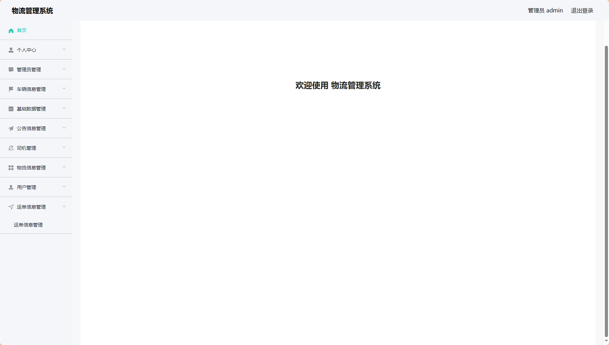
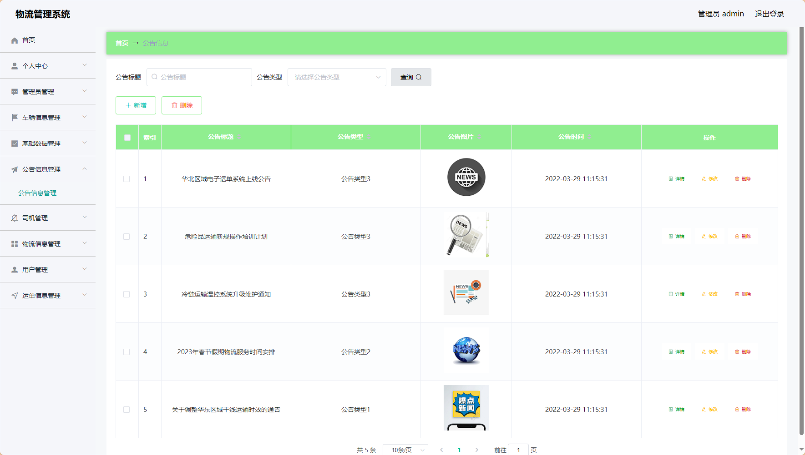
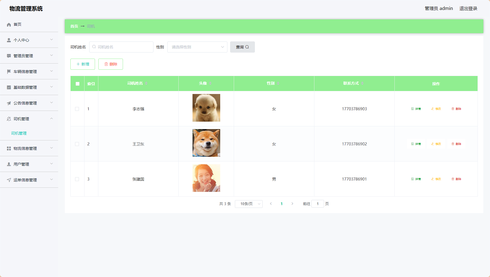
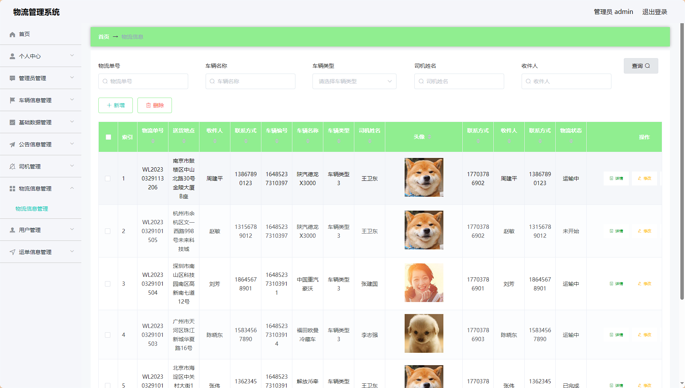
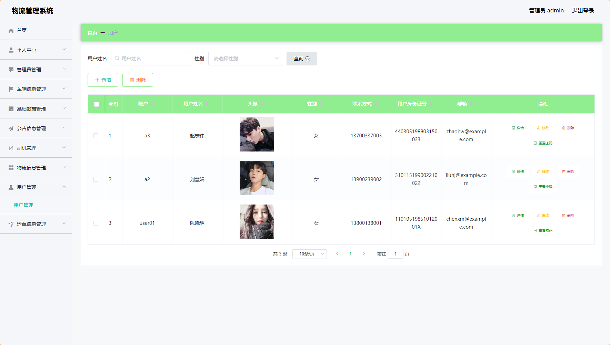
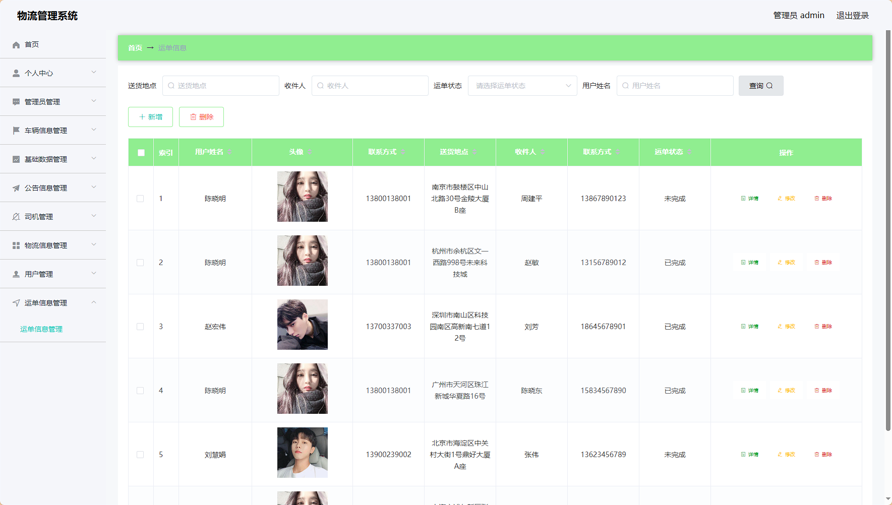
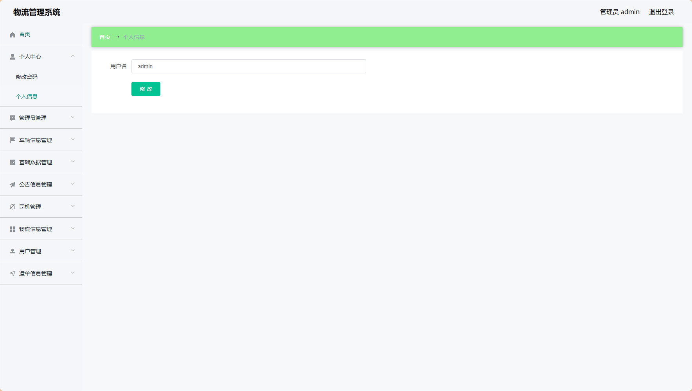
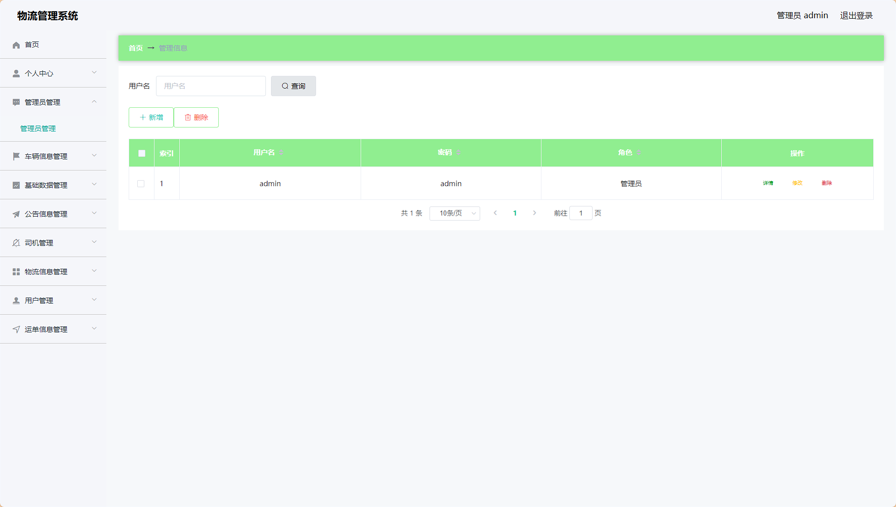
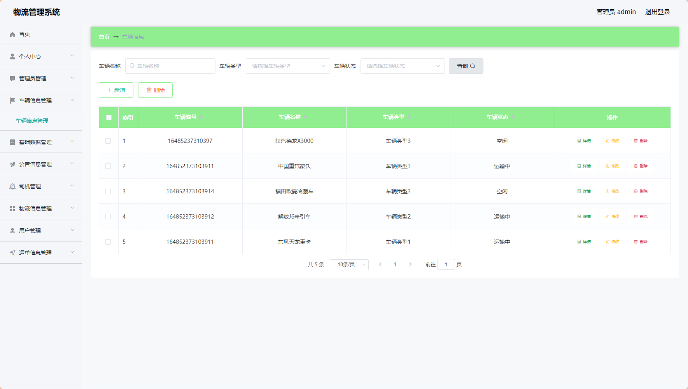

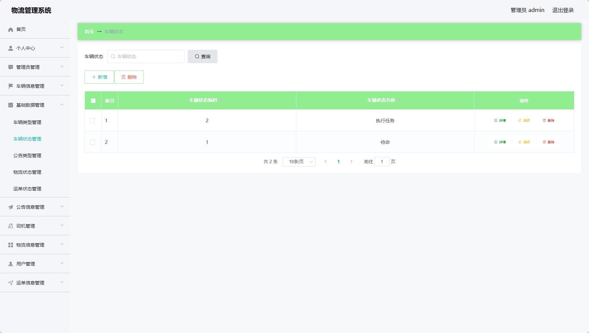
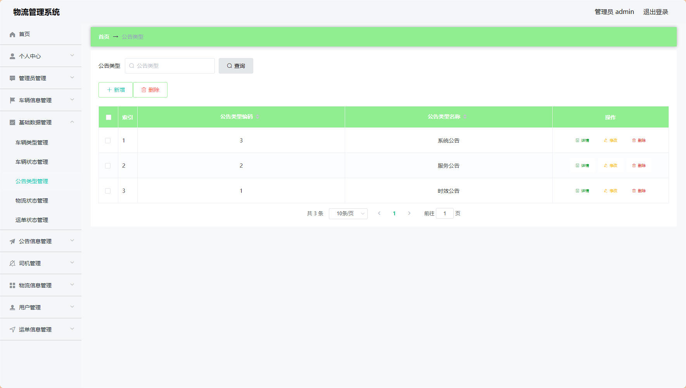
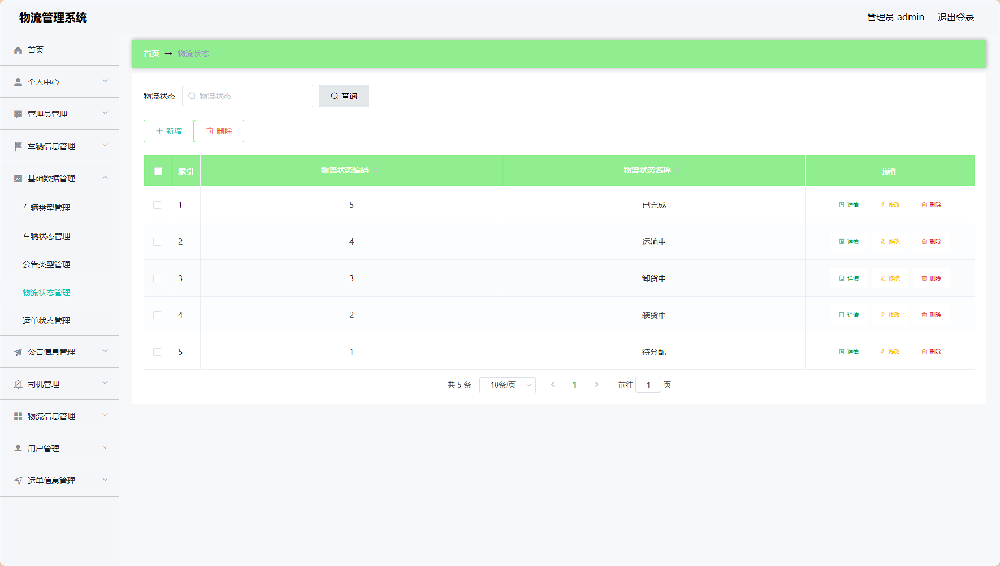


> 等等...

# 精选项目导航 & 快速部署工具
## 项目资源一站直达
- ​**访问项目导航站**：[点击进入](http://sysadmin.3vfree.vip)**快速检索所需项目名称**
- ​**技术栈全覆盖**：Java/SSm/Spring Boot/小程序等主流技术方案
- ​**配套资源**：每个项目均提供部署文档 + 演示视频（附效果截图）

### ▌导航站预览


### ▌工具界面预览


## 捐赠
> 博主将持续更新Java全栈开发项目，包含ssm，springboot，前后端分离系统等项目。
> 此外如果您够宽裕，请博主喝杯咖啡吧！捐赠将用于服务器维护与开源社区建设，感谢您的认可！
> 如需更多Java相关项目毕设3000+，有其他项目需求，sql文件等可联系博主v:xq-lucky311

---